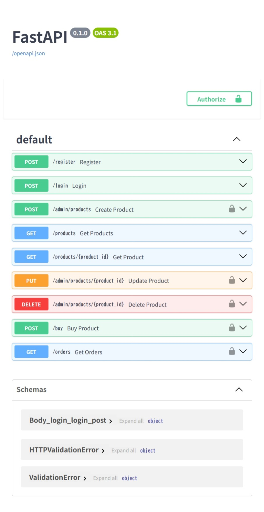

# 🛒 EC Shop API（FastAPI）

## 📌 概要

FastAPIを使用して開発したECサイト風のバックエンドAPIです。
ユーザー認証（JWT）、商品管理、購入処理、注文履歴など、実務を想定した機能を実装しています。

---

## 🚀 使用技術

* Python 3.11
* FastAPI
* SQLAlchemy
* SQLite
* JWT認証（python-jose）
* Docker / docker-compose

---

## 🔑 主な機能

### 👤 ユーザー機能

* ユーザー登録
* ログイン（JWT認証）

### 🛍️ 商品機能

* 商品一覧取得
* 商品詳細取得
* 商品検索（キーワード）
* ページネーション
* 商品登録（管理者）
* 商品更新（管理者）
* 商品削除（管理者）
* 商品カテゴリ機能（カテゴリ作成・分類・検索）

### 💳 購入機能

* 商品購入
* 在庫管理

### 📦 注文機能

* 注文履歴取得
* 合計金額計算
* 税込み価格表示
* 購入日時管理
* 注文ステータス管理（pending / shipped / delivered / cancelled）

---

## 🔐 認証・権限

* JWTによる認証
* 管理者ユーザーのみ商品操作可能

---

## 🗂️ ディレクトリ構成

```
app/
 ├─ main.py
 ├─ database.py
 ├─ models.py
 ├─ core/
 │   ├─ security.py
 │   ├─ deps.py
 ├─ routers/
 │   ├─ auth.py
 │   ├─ products.py
 │   ├─ orders.py
 ├─ tests/
 │   ├─ conftest.py
 │   ├─ test_auth.py
 │   ├─ test_products.py
 ├─ data/
 ├─ Dockerfile
 ├─ docker-compose.yml
 ├─ .env
 ├─ .gitignore
 ├─ requirements.txt
 ├─ README.md
```

---

## 🐳 起動方法（Docker）

```bash
docker-compose up --build
```

---

## 🌐 APIドキュメント

以下にアクセスするとSwagger UIが利用できます：

```
http://localhost:8000/docs
```

---

## 📡 API例
### カテゴリ作成（管理者）

POST /admin/categories

### 商品一覧（検索・カテゴリ）例

GET /products?keyword=iphone&category=スマートフォン&page=1&limit=10

### 注文作成

POST /orders

### 注文ステータス更新（管理者）

POST /admin/orders/{order_id}/status

---

## 📸 画面イメージ

### APIドキュメント（Swagger UI）

FastAPIの自動生成ドキュメントにより、APIの動作確認が可能です。



---

## 🧪 テスト

pytestを使用してAPIの動作確認を行っています。

```bash
pytest

---

## 💡 工夫した点

* CRUDをすべて実装し実務に近いAPI設計を意識
* 商品一覧APIに検索・ページネーションを統合
* JWT認証をSwaggerと連携し使いやすさを向上
* ディレクトリ構成を分離し保守性を向上
* 商品とカテゴリをリレーションで管理し、実務を意識したDB設計を実装
* 注文ステータスを導入し注文のライフサイクル管理を実現
* Swaggerのタグ分けとルーター順序を整理し可読性を向上

---

## 📈 今後の改善

* Pydanticによるレスポンススキーマ導入
* 商品検索の高度化（部分一致・複数条件）
* デプロイ（Render / Railway）
* テストコードの追加

---

## 👤 作成者

ポートフォリオ用に作成しました